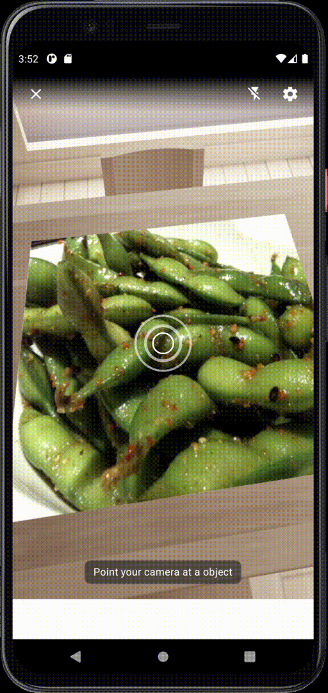

# NutAction

## Table of contents
- [User Interface](#User-Interface)
- [Introduction](#Introduction)
- [Features](#Features)
- [Upcoming features](#Upcoming-features)

## User Interface
**Barcode Scanner**

  

## Introduction
Although most of the products provide barcode for us to scan to acquire nutrition information, such food as street food, home-cook meals, etc would be difficult to know the nutrition unless user search the information on government websites, which is not convenient and would acquire a certain time to do so.
Therefore, we want to make nutrition information easily to be accessed for everyone.  Holding your phone all day just like other days, just remember to open NutAction, and it can offer you your daily nutrition comsumption.
The process of using NutAction application is simple ,for users, they only need to open the camera lens, **no other action required**. Just point yout phone to food, NutAction will record nutrition information automatically.

## Features
**Nutrition identification system**
Whether it's roadside snacks, supermarket food, or even fruits and vegetables in general, just use NutAction and 
turn on the camera, and the nutrition information of food will show up immediately!

**Daily nutrition manager**
Through our nutrition management system, we can help you grasp your daily nutrition and intake status in a timely manner, and we would like to be  your own nutrition management experts by matching your eating habits, health status and nutritional needs.

## Libraries Used
**App Development**
- Host our custom model in user mobile device by [FireBase ML kit](https://firebase.google.com/docs/ml-kit) .
- Using [Firebase Authentication](https://firebase.google.com/docs/auth) to authenticate user. 

**Data Engineering (Python)**
- Using **TensorFlow** for *ResNet50*,*InceptionV3* transfer learning.
- Using **TensorFlowLit**

## Upcoming features
Future updates will include following functions:
- Combined Google Map API to guide user to the nearby shop and store to buy food 
- Provide customized suggestion regarding weight, height and allergies.
